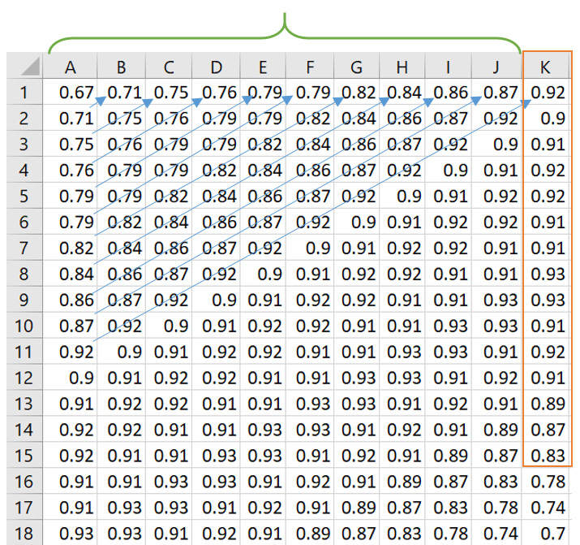

```{r setup, include=FALSE}
knitr::opts_chunk$set(echo = TRUE)
```

# Lab 4 - Physiological Sensors
## Timeseries

In the field of healthcare, time series analysis plays a crucial role in understanding and predicting various physiological signals. One such signal of great significance is the electrocardiogram (ECG) data, which provides valuable insights into the electrical activity of the heart. ECG signals are widely used in clinical practice for diagnosing cardiac abnormalities, monitoring patients' heart health, and assessing the efficacy of medical interventions.

Time series analysis allows healthcare professionals and researchers to explore patterns and trends within ECG data over time. By analyzing the sequential nature of ECG signals, we can uncover meaningful information such as heart rate variability, arrhythmias, and other cardiac irregularities. This analysis can aid in early detection of cardiovascular diseases, guiding treatment decisions, and improving patient outcomes.


## new packages

For this assignment task focused on time series analysis of ECG data, we will utilize two popular machine learning algorithms: neural networks and XGBoost.

Neural Networks:
Neural networks have been widely employed in time series analysis due to their ability to capture temporal dependencies and patterns.

XGBoost:
XGBoost (Extreme Gradient Boosting) is a popular machine learning algorithm known for its exceptional performance in various domains, including time series analysis. It is an ensemble-based algorithm that combines multiple weak learners (decision trees) to form a powerful predictive model.

```{r}
#install.packages("readxl")
#install.packages("xgboost")
```


```{r}
library(readxl)
library(readr)
library(xgboost)
library(torch)
library(ggplot2)
```


```{r}
ECG <- read_excel(path = "data_lab4/ECG.xlsx", col_names = FALSE)
```

Typically, ECG data is acquired and recorded as a multi-channel signal. A standard ECG recording consists of multiple leads or channels that capture the electrical activity of the heart from different positions on the body. The most commonly used configuration is the 12-lead ECG, which provides information from 12 different perspectives, offering a comprehensive view of the heart's electrical activity.

However, it is also common to work with single-channel ECG data, where only one lead or channel is considered. This single-channel ECG recording is often obtained using a single set of electrodes placed on the body, typically on the chest or the limbs. The advantage of using a single channel is its simplicity and ease of acquisition. It requires fewer electrodes and a simpler setup compared to multi-channel recordings.

**1** what are the advantages and disadvantages of single-channel? 

# Data Visualization

In the following the time series data is visualized

```{r}
ECG_ts = ts(ECG[,1])

plot(ECG_ts)
```

## Window Size:

In the context of time series analysis, a window size refers to the number of consecutive data points considered as a single observation or instance. For the purpose of your homework, you have chosen a window size of 10. This means that each observation in your analysis will consist of 10 consecutive ECG signal measurements, and the target of interest will be the ECG signal in the 11th position and onwards.

**0** 10 considers as a relatively small window size. What is the advantages of having small window size?

It's important to note that the choice of window size depends on the specific research question or analysis objective. When applying time series analysis techniques to healthcare data, it is essential to consider the clinical context, data characteristics, and the specific objectives of the analysis.



# Data Prepraction

The purpose of this code is to split the ECG dataset into training and testing sets, where the training set will be used to train a machine learning model, and the testing set will be used to evaluate the model's performance on unseen data.

This code performs the following operations:

Splitting the Dataset:

- The dataset ECG is split into two parts: input features (train_x) and target variable (train_y).
- The input features are selected from columns 1 to 10 of the ECG dataset and stored in the variable X.
- The target variable is extracted from the 11th column of the ECG dataset and stored in the variable Y as a vector.

Calculating the Number of Rows for Training and Testing:

- The total number of rows in the ECG dataset is obtained using nrow(ECG).
- The number of rows for training is calculated as 80% (0.8) of the total number of rows and stored in the variable train_rows.
- Splitting the Dataset into Training and Testing Sets

```{r}
# Split the dataset into input features (train_x) and target variable (train_y)
X <- ECG[, 1:10]
Y <- unlist(ECG[, 11])

# Calculate the number of rows for training and testing
num_rows <- nrow(ECG)
train_rows <- round(0.8 * num_rows)

# Split the dataset into training and testing sets
train_x <- as.matrix(X[1:train_rows, ])
train_y <- Y[1:train_rows]
test_x <- as.matrix(X[(train_rows+1):num_rows, ])
test_y <- unlist(Y[(train_rows+1):num_rows])
```


This code snippet defines a custom dataset class named "ImageDataset" and utilizes it to create dataset and dataloader objects for training and testing purposes. It then demonstrates how to iterate over batches of data and visualize the size of the first batch.

```{r}
# Define a custom dataset class
ImageDataset <- dataset(
  name = "ImageDataset",
  initialize = function(X, y) {
    # Store the data as tensors
    self$data <- torch_tensor(X)
    self$labels <- torch_tensor(y)
  },
  .getitem = function(i) {
    # Return a single sample and label
    x <- self$data[i,]
    y <- self$labels[i]
    list(x = x, y = y)
  },
  .length = function() {
    # Return the number of samples
    dim(self$data)[1]
  }
)

# Create a dataset object from your data
train_dataset <- ImageDataset(train_x, train_y)
test_dataset <- ImageDataset(test_x, test_y)

# Create a dataloader object from your dataset
train_dataloader <- dataloader(train_dataset)
test_dataloader <- dataloader(test_dataset)

# Iterate over batches of data
batch = train_dataloader$.iter()$.next()

# Visualize the first batch size
batch[[1]]$size()
```

The network has an input layer of size 10, two hidden layers with dimensions 7 and 4 respectively, ReLU activation functions applied after each hidden layer, and an output layer with 1 neuron. The network takes input data, passes it through the hidden layers with linear transformations and ReLU activations, and produces a single output.

**2** what other activation function we can use?
**3** why we don't have an activation function after the last neuron?

This code defines a neural network model with three linear layers. The initialize function sets up the layers, and the forward function specifies how the input data flows through the layers to produce the output.

```{r}
net = nn_module(
  "class_net",

  initialize = function(){

    self$linear1 = nn_linear(10,7)
    self$linear2 = nn_linear(7,4)
    self$linear3 = nn_linear(4,1)

  },

  forward = function(x){

    x %>%
      self$linear1() %>%
      nnf_relu() %>%
      self$linear2() %>%
      nnf_relu() %>%
      self$linear3()

  }
)
```

The provided code trains a neural network model (model2) using a specified loss function (mean square error) and an optimization algorithm (optim_sgd). The training process is performed over a given number of epochs, and the loss and output values are saved for each epoch to track the model's training progress.

**4** How Mean Square Error calculate the loss?

Two plots are generated after each epoch to visualize the training and testing outputs.

The output_train and output_test values are plotted in red, while the true target values (train_y and test_y) are plotted in blue.


```{r warning=FALSE}
model2 = net()

loss_fn <- nn_mse_loss()
learning_rate <- 0.01

optimizer <- optim_sgd(as.list(model2$parameters), lr = learning_rate)
# Assuming you have your input data `x` and target data `y` prepared as tensors

# Set the number of training epochs
num_epochs <- 3
train_loss <- numeric(num_epochs)
test_loss <- numeric(num_epochs)

for (epoch in 1:num_epochs) {
  count <- 0
  epoch_loss <- 0
  output_train <- c()
  for (batch in enumerate(train_dataloader)) {
    x <- batch$x
    y <- batch$y
    # Forward pass
    y_pred <- model2(x)
  
    # Compute the loss
    loss <- loss_fn(y_pred, y)
  
    # Zero gradients
    optimizer$zero_grad()
  
    # Backward pass
    loss$backward()
  
    # Update weights
    optimizer$step()
    
    # storing results
    count <- count + 1
    epoch_loss <- epoch_loss + loss$item()
    output_train <- c(output_train, as_array(y_pred))
  }
  cat("Epoch:", epoch, "Train_Loss:", epoch_loss/count, "\n")
  train_loss[epoch] <- epoch_loss/count
  
  count <- 0
  epoch_loss <- 0
  output_test <- c()
  for (batch in enumerate(test_dataloader)) {
    x <- batch$x
    y <- batch$y
    # Forward pass
    y_pred <- model2(x)
  
    # Compute the loss
    loss <- loss_fn(y_pred, y)
  
    count <- count + 1
    epoch_loss <- epoch_loss + loss$item()
    output_test <- c(output_test, as_array(y_pred))
  }
  cat("Epoch:", epoch, "Test_Loss:", epoch_loss/count, "\n")
  test_loss[epoch] <- epoch_loss/count
  
  plot(output_train, type = "l", xlab = "Index", ylab = "Value", col = "red")
  lines(train_y, col = "blue")

  plot(output_test, type = "l", xlab = "Index", ylab = "Value", col = "red")
  lines(test_y, col = "blue")
}

```

**5** What insights can you gather from the loss plot and the model's predictions?

**6** By modifying the learning rate and number of epochs, how do the results change in your experiment?

```{r}
# Plot the train and test loss
loss_df <- data.frame(
  Epoch = 1:num_epochs,
  Train_Loss = train_loss,
  Test_Loss = test_loss
)
loss_plot <- ggplot(data = loss_df) +
  geom_line(aes(x = Epoch, y = Train_Loss, color = "Train Loss")) +
  geom_line(aes(x = Epoch, y = Test_Loss, color = "Test Loss")) +
  labs(x = "Epoch", y = "Loss") +
  scale_color_manual(values = c("Train Loss" = "blue", "Test Loss" = "red")) +
  theme_minimal()

# Print the plots
print(loss_plot)
```

The other model that we used in this practical is XGBoost. XGBoost is a powerful machine learning library that excels in handling tabular data and has proven to be effective in various prediction tasks. It leverages gradient boosting algorithms to create an ensemble of decision trees, resulting in accurate predictions. By using XGBoost, this code trains a regression model and makes predictions based on the trained model using the provided training and testing data.

Setting Hyperparameters for XGBoost:

- Hyperparameters control the behavior of the XGBoost model.
- The hyperparameters are specified as a list named params.
- The objective parameter is set to "reg:squarederror" to indicate that the model aims to minimize the mean squared error loss.
- The eta parameter represents the learning rate, which controls the step size at each boosting iteration.
- The max_depth parameter determines the maximum depth of the decision trees used in the boosting process.
- The num_rounds parameter indicates the number of boosting iterations or rounds to perform.

```{r}
# Convert the training data to DMatrix format
dtrain <- xgb.DMatrix(data = as.matrix(train_x), label = train_y)

# Set the hyperparameters for XGBoost
params <- list(
  objective = "reg:squarederror",
  eta = 0.1,
  max_depth = 3,
  num_rounds = 100
)

# Train the XGBoost model
model <- xgb.train(params, dtrain, nrounds = 10)

# Convert the testing data to DMatrix format
dtest <- xgb.DMatrix(data = as.matrix(test_x))

# Make predictions on the test data
predictions <- predict(model, dtest)
```
## Visualize the output
```{r}
plot(test_y, predictions, xlab = "Actual", ylab = "Predicted")
abline(0, 1, col = "red") # add a 45-degree line for reference
```
**7** Modify the hyperparameters of the XGBoost model and observe the resulting outcomes.

**8** When comparing the results of the neural network (NN) and XGBoost models, which one do you believe is providing better outcomes? Why do you think that is the case?

**8** Describe 2 possible alternative modelling approaches we discussed in class but haven’t explored in this notebook.

